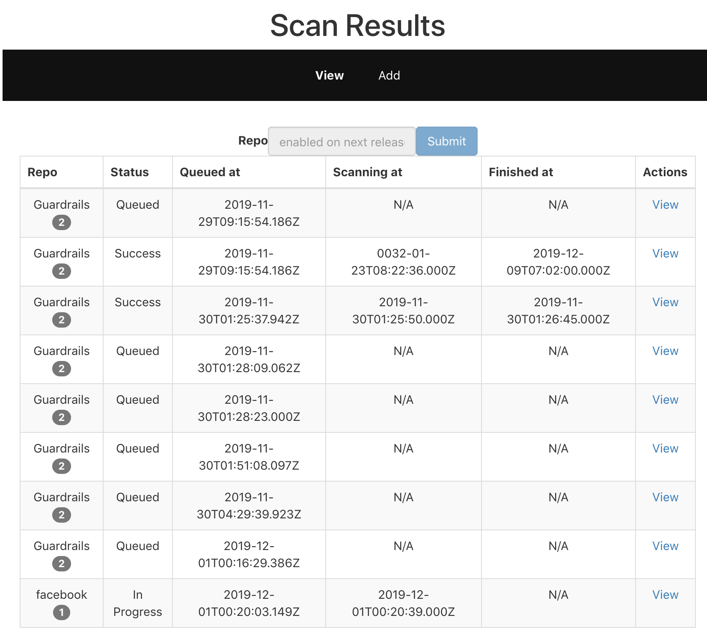
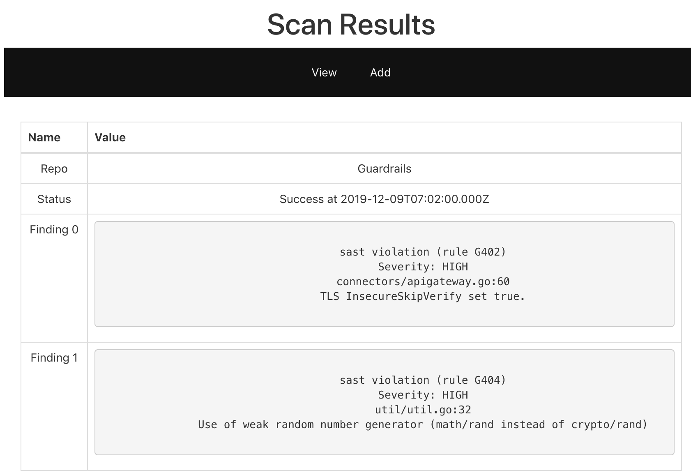
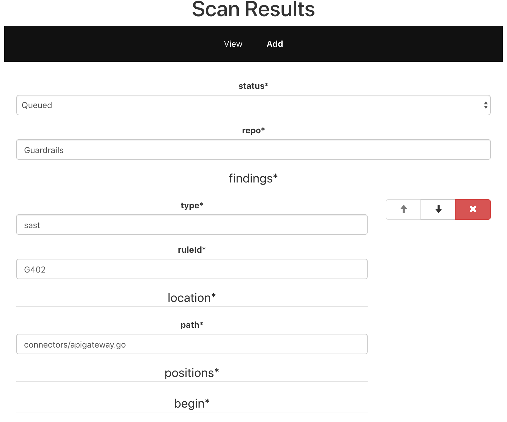

# Introduction
Completing the guardrails.io [challenge](https://github.com/guardrailsio/full-stack-engineer-challenge).

# Screenshots

# Devops
Monorepo with a simple `Dockerfile` for the `api` and `dashboard`.  Environment variables are used to speciy which port on the host each service maps to.

# Server
My intention is that there's are two server components, one that runs the scans (scanner), and the other that aggregates and stores the results (reporter).  The scanner will report results to the reporter.  This section will focus on the design of the reporter.
## HTTP Endpoints
My thought process was to separate how we get a list and how we get the details on the results.  This way, there is a clearly defined API for retrieving all entries for a repo and updating individual results.

| Endpoint             | Get | Post | Put | Patch |
|:---------------------|:---:|:----:|:---:|:-----:|
| api/scan/list/<repo> | Y   |      |     |       |
| api/scan/result      |     | Y    |     |       |
| api/scan/result/<id> | Y   |      | Y   | TODO  |

### Validation
Server side validation will leverage the Mongoose models.  I didn't think it was necessary to write additional logic since it will be harder to maintain if the validation of the request and model is decoupled from each other.  Also, by trusting that Mongoose has validated their validation logic, it puts less burden on us to unit test it.  Integreation tests will still be necessary
### TODO
* A patch operation using a package like `json-patch` would be nice.  The idea would be that the server running the scan would send a patch operation when it transitions to `In Progress`, and adds a findings as it detects security holes.  This would allow the user to see real time results.  It will also have lower bandwidth requirements.  But, for simplicity sake of this exercise, I'll only implement `Post`.
## Database
I believe a document database would be good for representing this data.  The data is structured really well as a document, and a document database gives us the ability to have complicated queries.  We don't have any hard requirements for consistency, availability, or partition tolerance.  So, I opted not to use a relational database since partition tolerance is easy to configure with MongoDB, and we may need to rapidly expand in the future.  The document database could index the `repo` field to allow performant queries of scan results for a particular repo.
### Schema
The schema is pretty straight forward based on the requirements.  
#### TODO 
Change `status`, `ruleId`, and `severity` to be represented as enums instead of a string.  This will save space, and we can allow the client to translate the enum values to user-friendly strings (along with localization).  For the simplicity sake of the exercise, I just represented it as a string to reduce effort, even if just a little.
## Testing
I focused on integration tests as they added more value compared to unit testing.  I didn't see any value in unit testing a lot of the logic since I relied on Mongoose functionality to validate data.  It's not worth using `mockingoose` to mock the functionality of mongoose when integration tests will test the validation functionality and the endpoints.

# Dashboard
The view of scan results is what I choose to be customer facing.  The adding of scan results is more of an admin tool.  As dicussed in the server section, I was envisioning a server that runs the scans and reports it via the REST API.
## Bundling
I didn't feel that creating a project from scratch using `parcel` or `webpack` would showcase any skills, so I opted to just use `create-react-app`.
## UI
I kept it simple per recommendations of the exercise
## State
Relevant components are "dumb" so that it'll be easy to switch over to Redux state gets complicated enough
## Components
### Adding a Result
I wanted a maintainable way to represent and render the data.  I also didn't want to worry about writing my own client-side validation.  So, I chose `react-jsonschema-form` since it allows us to generate a component based on a JSON schema and validates it according to the schema.  It also conveniently represents the data as JSON which is what the API expects. For this exercise, out of convenience, I added a `bootstrap` dependency since the component is styled out of the box with bootstrap.  Normally, I'd try to avoid this dependency.
### Display a List of Results
This component will query a list of all repos.  The API supports querying results for a single repo which the `SearchBar` component could handle (not implemented for this exercise)
### Displaying details of a result
I used a simple table to represent this since the exercise stated that we don't need to focus on making things too pretty.
## Testing
In the future, I'd use `enzyme` to test components using different props. Some components will crash if the object does not have all the expected nested properties. I'd also just do render tests.  

# Other Considerations
An alternative way of displaying the scan results would be to consolidate all findings for a particular repo into a single row.  To enable this, it would be simple to either combine it on the client or aggregate it on the server.
